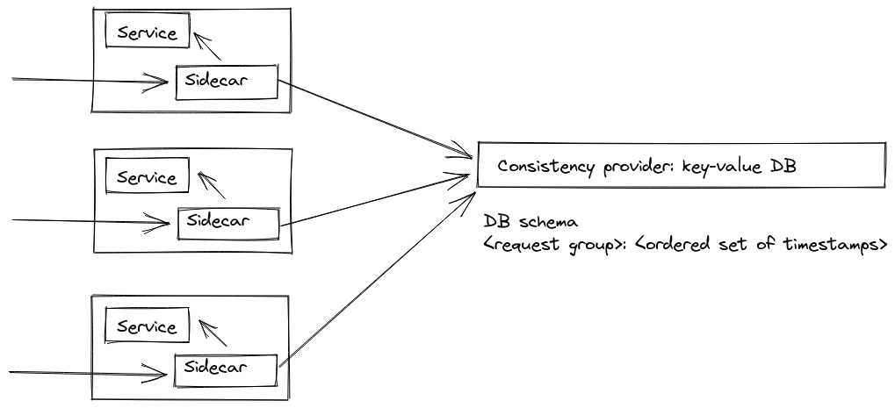

# Архитектура распределенного Rate Limiter (алгоритм sliding log)

Для реализации расперделенного rate limiter (ограничение суммарной нагрузки на несколько сервисов)
необходимо два компонента: прокси для контроля потока запросов и механизм синхронизации между ними.

Наиболее простым в реализации является общий центральный прокси, через который проходят все запросы, однако такое 
решение создает single point of failure и имеет ограничения по масштабированию. 

Альтернативным вариантом реализации является
использование выделенных прокси на каждый сервис (sidecar или embedded) и синхронизация между ними через базу данных. На каждый вид ресурса (например, адрес URL)
в базе хранится набор временных меток доступов к этому ресурсу. При поступлении нового запроса прокси проверяет в базе лог запросов и на основании него принимает 
решение, пропускать или отклонять этот запрос.

От базы требуется консистентность и эффективная реализация запросов вида `put(timestamp)` и `countBetween(t1, t2)`. На практике такому API лучше всего соответсвуют key-value базы данных.
В частности, Redis позволяет эффективно хранить записи в нужном формате и предоставляет встроенный функционал для реализации нужных запросов: структура SortedSet и операции `ZADD`, `ZCOUNT`.