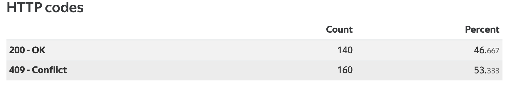
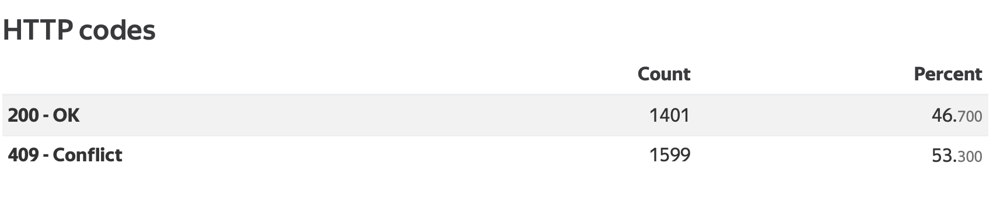
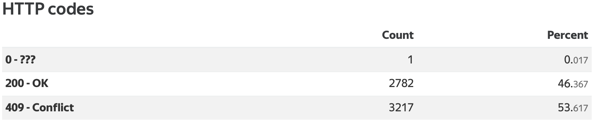

## Тестирование

Для проведения тестирования, помимо реализации Unit-тестов, было развернуто простое веб-приложение,
 состоящее из контроллера с одним методом /test, содержащего в себе rateLimiter, отвечающее 200 если запрос проходит и 409 в случае нет.
RateLimiter имеет ограничение в 5 запросов за секунду.
 
 
Далее это приложение было подвергнуто нагрузочному тестированию утилитой Yandex-tank.

Было произведено 3 запуска, утилита настроена на подачу постоянной нагрузки в 10 запросов, с различными интервалами нагрузки сервиса(30 секунд, 5 минут, 10 минут).

Тестирование в течение 30 секунд:

Тестирование в течение 5 минут:

Тестирование в течение 10 минут(1 запрос не был обработан сервисом, из-за проблем с сетью):

Успешно проходит менее 50% запросов, что говорит о корректности работы RateLimiter. 
Выполняется не ровно 50% запросов, так как запрос доходит до приложения не моментально(есть latency сети), также yandex-tank отправляет запросы в приложение не разово в один момент времени, а в течение одной секунды.

С полными отчетами можно ознакомиться по ссылкам:

https://clck.ru/Z5t93

https://clck.ru/Z5tEY

https://clck.ru/Z5tF9

 
